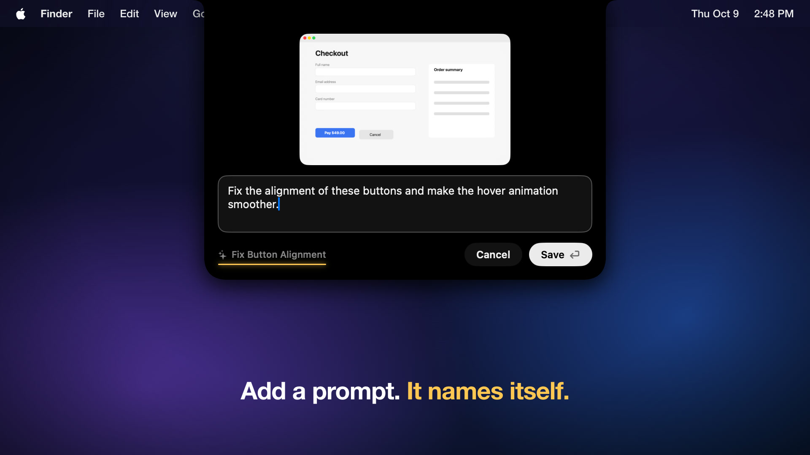
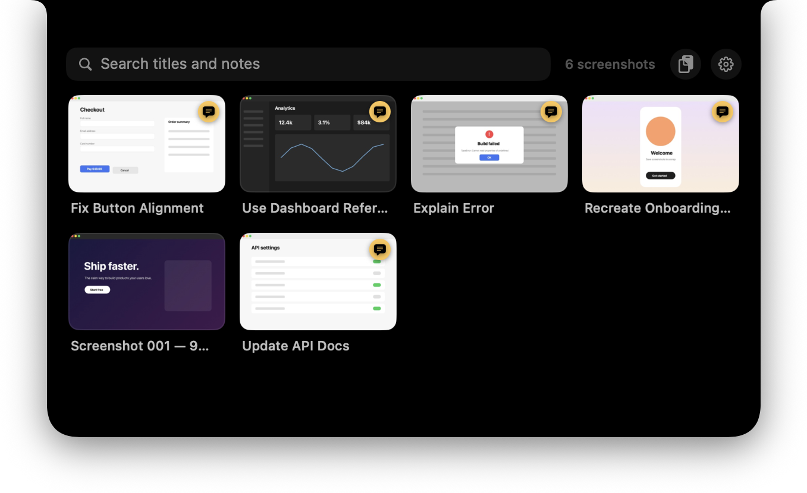
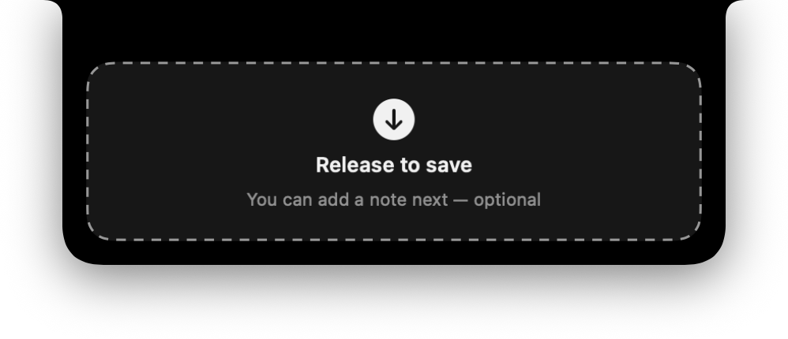
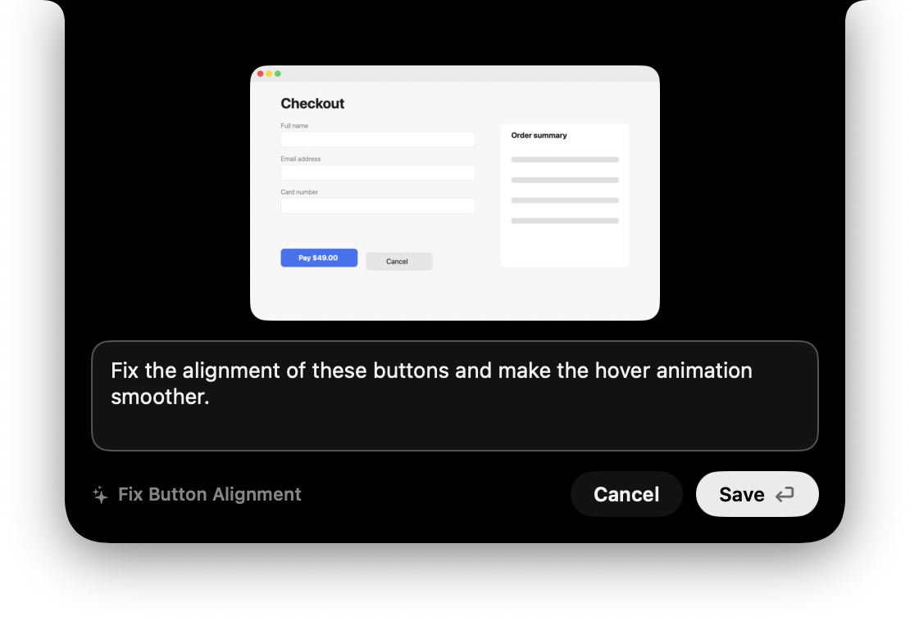
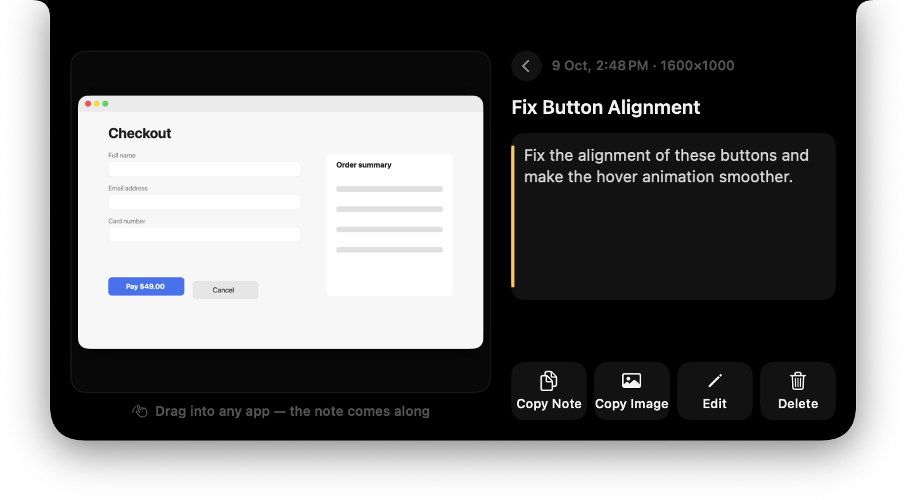
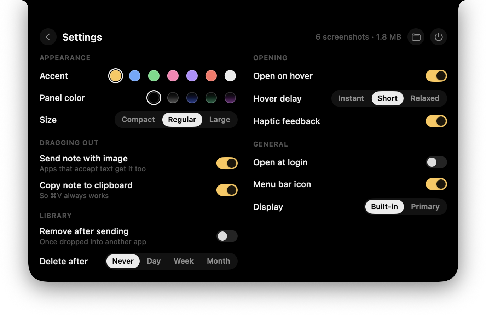

https://github.com/user-attachments/assets/16901d96-31a6-45b3-96db-2cbbbaf84c35

# Screenshot+

**A screenshot inbox that lives in your MacBook's notch.**

Take a screenshot, drag it onto the notch, add a note or AI prompt, done. Later, hover the notch, find it, and drag it straight into Claude, ChatGPT, Cursor, Slack, or any other app — the note comes along.

<p align="center">
  <a href="https://github.com/Tumble-ops/screenshot-plus/raw/main/docs/launch-video.mp4">
    
  </a>
  <br>
  <sub>▶ <a href="https://github.com/Tumble-ops/screenshot-plus/raw/main/docs/launch-video.mp4">Launch video</a> — 21 s with sound (MP4, 2.5 MB)</sub>
</p>

<p align="center">
  
</p>

- **Save in three moves:** drag → note (optional) → Save (⏎)
- **Use in three moves:** hover the notch → find it → drag it out
- **Notes stay text.** They're never baked into the image. When you drag a screenshot out, the note travels with it as text and is copied to the clipboard, so ⌘V always works.
- **Automatic titles, on-device.** "Fix the alignment of these buttons and make the hover animation smoother." becomes **Fix Button Alignment**. Screenshots without a note get "Screenshot 001 — Oct 8, 10:42 PM".
- **Private by design.** Everything stays on your Mac. No account, no network, no analytics, and no Screen Recording or Accessibility permission.

## Install

Requires **macOS 14 Sonoma or later**. Works best on a MacBook with a notch; other Macs and external displays get a small notch-shaped pill at the top of the screen.

### Download

1. Download `Screenshot+.zip` from the [latest release](../../releases/latest) and unzip it.
2. Move **Screenshot+.app** to your Applications folder and open it.
3. Releases aren't notarized by Apple, so the first launch is blocked. Open **System Settings → Privacy & Security**, scroll down, and click **Open Anyway** next to Screenshot+. You only need to do this once.

   Prefer the terminal? `xattr -dr com.apple.quarantine "/Applications/Screenshot+.app"` does the same.

### Build from source

Needs Xcode 16 or later (or its command line tools).

```bash
git clone https://github.com/Tumble-ops/screenshot-plus.git
cd screenshot-plus
scripts/build-app.sh --install   # builds, copies to /Applications, launches
```

## Using it

| | |
| --- | --- |
|  | **Save.** Drag a screenshot (the floating thumbnail, a file from Finder, or an image from a browser) toward the notch. It opens into a drop zone. |
|  | **Add a note** or prompt if you like — the live title preview shows what it'll be called — and press Return. |
|  | **Find and use.** Hover the notch to open the library, search titles and notes, and drag a thumbnail into any app. Click one for the full view: rename it, edit the note, copy the note or image, or delete it. |
|  | **Settings** live in the notch too (gear button): accent and panel colour, size, hover behaviour, drag-out options, auto-delete after a day/week/month, remove after sending, Open at Login, and more. |

Hover any thumbnail for a quick delete button; deletions go to the Trash and can be undone right from the notch. The menu bar icon has the same essentials, plus **Save Image from Clipboard** for screenshots taken with ⌃⇧⌘4.

### How the note travels

Every app decides for itself what to do with a drop:

- **Notes, Mail, Messages, TextEdit** and other native text fields take both the image and the note.
- **Most AI chat apps (Claude, ChatGPT, Cursor) and Terminal** attach the image and ignore the dropped text. That's why the note is also copied to the clipboard: drop, then ⌘V.
- In **Terminal**, dropping inserts the image's file path, which tools like Claude Code pick up. Copies of dragged screenshots are kept for a day so a path still works if you send the message later.

If an app ever inserts the note *instead of* the image, turn off **Send note with image** in Settings.

## How it works

Screenshot+ is a native Swift app (SwiftUI for the interface, AppKit for the window, drag-and-drop and clipboard).

| Piece | Where |
| --- | --- |
| Borderless, non-activating panel over the notch. It only takes the mouse over its visible surface, so the menu bar keeps working. | `Notch/NotchPanel.swift`, `Notch/NotchController.swift` |
| An invisible sensor exactly over the notch (no pixels or menu items there), so hover, click and drop always land | `Notch/NotchSensor.swift` |
| Drag in: file URLs (Finder, the screenshot thumbnail), file promises (browsers), raw PNG/TIFF/JPEG/HEIC | `Notch/DropHandler.swift`, `ScreenshotPlusCore/ImageImporter.swift` |
| Drag out: a real `NSDraggingSession` with the image file (named after its title) plus the note as a second text item | `Notch/DragSource.swift` |
| Local titles via Apple's NaturalLanguage framework | `ScreenshotPlusCore/TitleGenerator.swift` |
| Storage: `~/Library/Application Support/Screenshot+/` — `library.json`, original images untouched, small thumbnails | `ScreenshotPlusCore/ShotStore.swift` |

Pointer tracking uses standard mouse-event monitors (no Accessibility permission) and only polls while the panel is open, so it costs nothing at rest.

## Contributing

Bug reports, ideas and pull requests are welcome — see [CONTRIBUTING.md](CONTRIBUTING.md).

## License

[MIT](LICENSE)
